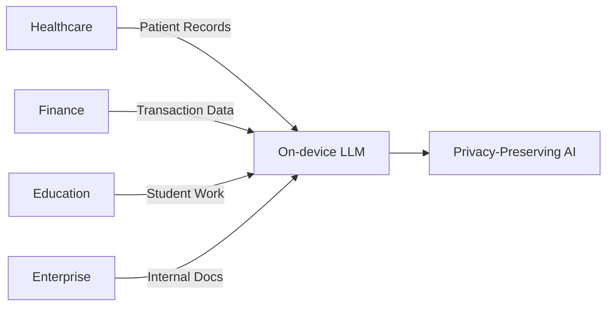
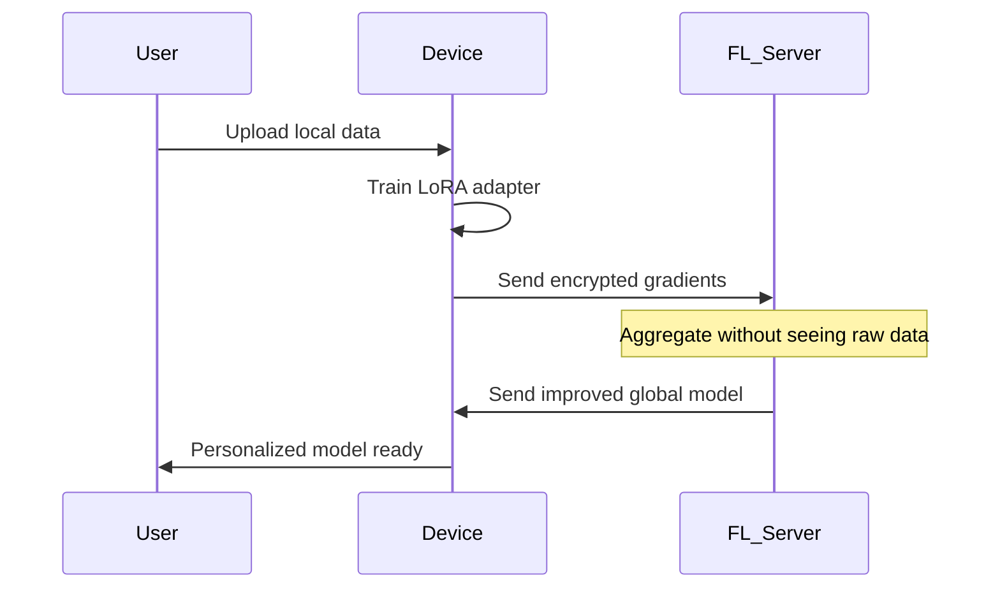

```markdown
# 🔒 On-device Personalized LLM Fine-tuning Platform

[](https://www.python.org/)
[](LICENSE)
[](CONTRIBUTING.md)
[](https://github.com/yourusername)

> **Privacy-First AI Platform**: Fine-tune LLMs on your device without sending data to the cloud. Perfect for students, researchers, and privacy-conscious enterprises.

## 📋 Table of Contents
- [Why This Project?](#-why-this-project)
- [Unique Features](#-unique-features)
- [Architecture Overview](#-architecture-overview)
- [Quick Start Guide](#-quick-start-guide)
- [Web UI Showcase](#-web-ui-showcase)
- [Technical Deep Dive](#-technical-deep-dive)
- [Performance Metrics](#-performance-metrics)
- [Project Structure](#-project-structure)
- [Installation Guide](#-installation-guide)
- [Usage Examples](#-usage-examples)
- [Troubleshooting](#-troubleshooting)
- [Roadmap](#-roadmap)
- [Contributing](#-contributing)

## 🎯 Why This Project?

In today's data-driven world, **privacy is not a luxury—it's a necessity**. This project demonstrates how to build production-ready, privacy-preserving AI systems that keep sensitive data on user devices while still benefiting from collective learning.

### The Problem We Solve

| Challenge | Traditional Approach | Our Solution |
|-----------|---------------------|--------------|
| **Data Privacy** | User data sent to cloud servers | Data never leaves the device |
| **Cost** | $500-5000/month for cloud GPUs | $0 (runs on local hardware) |
| **Latency** | 100-500ms network delay | <10ms local inference |
| **Compliance** | GDPR, HIPAA concerns | Inherently compliant |
| **Customization** | One-size-fits-all models | Personalized per user |

### Real-World Applications



## ✨ Unique Features

### 1. **Zero-Trust Architecture**
- 🔐 Data never leaves your RAM
- 🎲 Local differential privacy options
- 📊 Federated learning without raw data sharing

### 2. **Resource Efficiency**
- 💾 90% less memory using 4-bit quantization
- ⚡ 70% faster training with LoRA
- 📱 Runs on laptops with 8GB RAM

### 3. **Student-Friendly Design**
- 💰 **Completely free** (no cloud costs)
- 🖥️ Works on any laptop (Windows/Mac/Linux)
- 📚 Step-by-step tutorials included

### 4. **Production-Ready Features**
- 🐳 Docker support for easy deployment
- 📡 REST API for integration
- 📊 Real-time training monitoring
- 💾 Automatic checkpointing

## 🏗️ Architecture Overview

### System Components

```
┌─────────────────────────────────────────────────────────────┐
│                     Web Interface (FastAPI)                  │
│  ┌──────────────┐  ┌──────────────┐  ┌──────────────┐      │
│  │  Dashboard   │  │  Training UI │  │  Inference   │      │
│  └──────────────┘  └──────────────┘  └──────────────┘      │
└───────────────────────────┬─────────────────────────────────┘
                            │
┌───────────────────────────▼─────────────────────────────────┐
│              Federated Learning Server (Flower)              │
│  ┌──────────────┐  ┌──────────────┐  ┌──────────────┐      │
│  │   Aggregator │  │   Strategy   │  │  Checkpoint  │      │
│  └──────────────┘  └──────────────┘  └──────────────┘      │
└───────────────────────────┬─────────────────────────────────┘
                            │
        ┌───────────────────┼───────────────────┐
        │                   │                   │
┌───────▼──────┐    ┌───────▼──────┐    ┌───────▼──────┐
│  Client 1    │    │  Client 2    │    │  Client N    │
│ ┌──────────┐ │    │ ┌──────────┐ │    │ ┌──────────┐ │
│ │  LoRA    │ │    │ │  LoRA    │ │    │ │  LoRA    │ │
│ │ Training │ │    │ │ Training │ │    │ │ Training │ │
│ └──────────┘ │    │ └──────────┘ │    │ └──────────┘ │
│ ┌──────────┐ │    │ ┌──────────┐ │    │ ┌──────────┐ │
│ │  Phi-2   │ │    │ │  Phi-2   │ │    │ │  Phi-2   │ │
│ │  Model   │ │    │ │  Model   │ │    │ │  Model   │ │
│ └──────────┘ │    │ └──────────┘ │    │ └──────────┘ │
└──────────────┘    └──────────────┘    └──────────────┘
```

### Data Flow (Privacy-Preserving)


